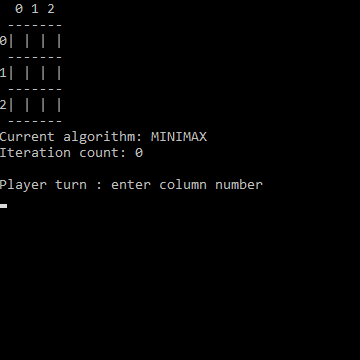
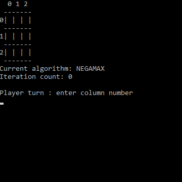
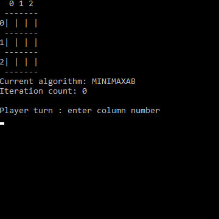
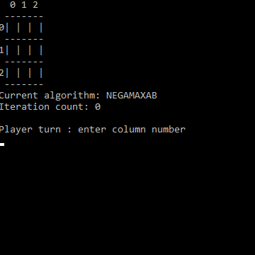

# MiniMax - C#
## ISART DIGITAL : School Project - GP3 - Rémi GINER

<!-- ABOUT THE PROJECT -->
# About The Project 
**Built with Unity 2021.3.5f1**

The goal of the project is to code several algorithms capable of solving a given tic-tac-toe game. The program must implement the MiniMax algorithm, the NegaMax simplification and the Alpha-Beta pruning extension to reduce the number of recursive calls.

# Features & usage

## Features
- MiniMax algorithm
- NegaMax algorithm
- Alpha-beta pruning for MiniMax
- Alpha-beta pruning for NegaMax

## Controls
The controls are made for keyboard only:
- 1-4 - Select an algorithm
- 0-3 - Select a line or a column

# How to launch
Launch the exe directly from the archive.

# Details

## Algorithms iteration benchmark

MiniMax - Worst case: 34313 | Best case: 29633

NegaMax - Worst case: 34313 | Best case: 29633

MiniMaxAB - Worst case: 1717 (~20000% iteration decrease) | Best case: 1343 (~22000% iteration decrease)

NegaMaxAB - Worst case: 1717 (~20000% iteration decrease) | Best case: 1343 (~22000% iteration decrease)

## References:
* https://en.wikipedia.org/wiki/Minimax
* https://en.wikipedia.org/wiki/Alpha%E2%80%93beta_pruning
* https://en.wikipedia.org/wiki/Negamax
* https://en.wikipedia.org/wiki/Negamax#Negamax_with_alpha_beta_pruning

## Versionning
Git Lab for the versioning.

## Author
**Rémi GINER**